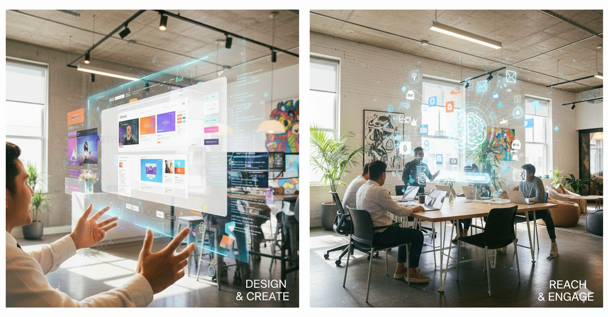
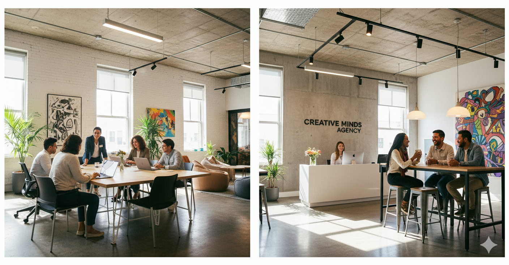

# Práctica Final: Nexus Agency Home Corporativa

## Descripción del proyecto

Proyecto final para la asignatura que comprende el desarrollo front-end de la home corporativa para la empresa de marketing **Nexus Agency**. Desarrollado con **React** y **Tailwind CSS**, implementa un mini sistema de diseño, componentes reutilizables sin dependencias de UI framework externas (usando puro Tailwind), e integra soporte completo para modo noche.

## Capturas de la Home

### Modo Claro
*(Nota del desarrollador: Aquí el estudiante debe incrustar sus propias capturas locales)*

### Modo Oscuro
*(Nota del desarrollador: Aquí el estudiante debe incrustar sus propias capturas locales)*

## Sistema de Diseño

Se ha seguido un sistema de diseño consistente:
- **Colores:** Se utilizan variables de tema a través de Tailwind CSS (`bg-background`, `text-foreground`, colores primarios e inversos). 
- **Tipografía:** Se estableció un jerarquizado directo mediante pesos variados en fuentes de sistema sin-serif con un buen espaciado clásico (`tracking-tight`).
- **Componentes base:** Creación modular de componentes mínimos como `<Button />`, `<Card />` o `<Input />` utilizando `forwardRef` para respetar el patrón de diseño estandarizado sin incluir librerías prohibidas como Shadcn o MUI.
- Puedes encontrar una explicación mayor y los colores exactos en el [PDF del Design System](./src/assets/Design_System.pdf).

## Instrucciones para levantar el proyecto

1. Realizar `npm install`
2. Ejecutar de manera local con `npm run dev`
